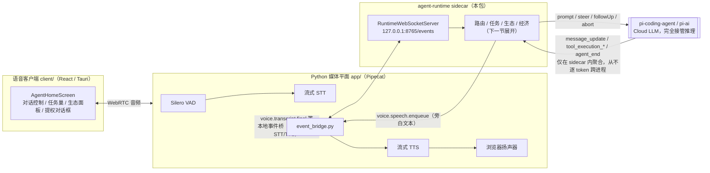
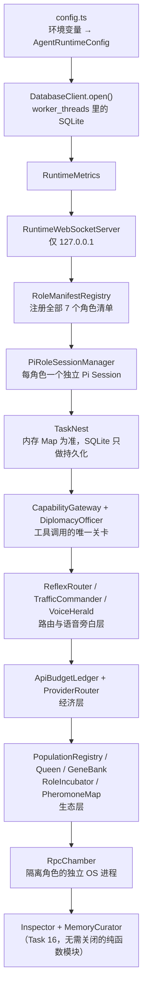
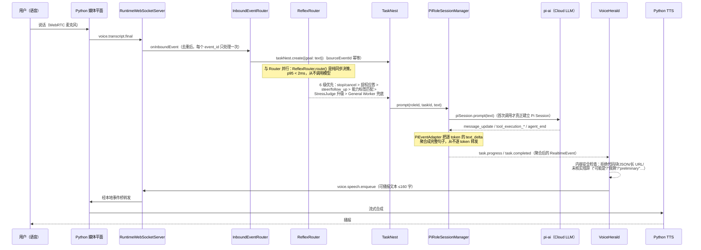
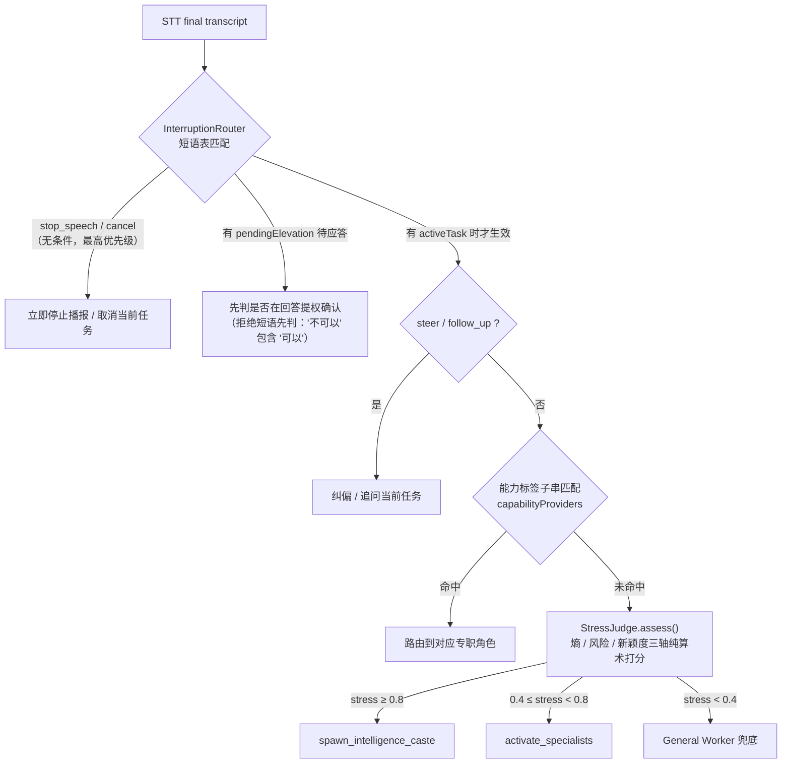
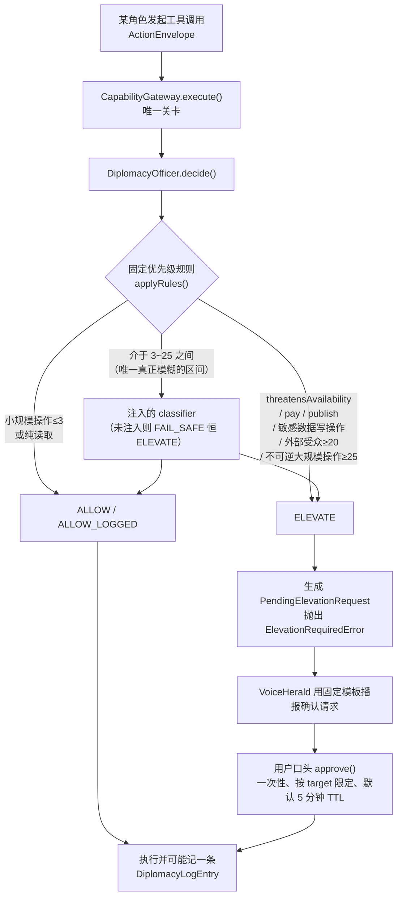
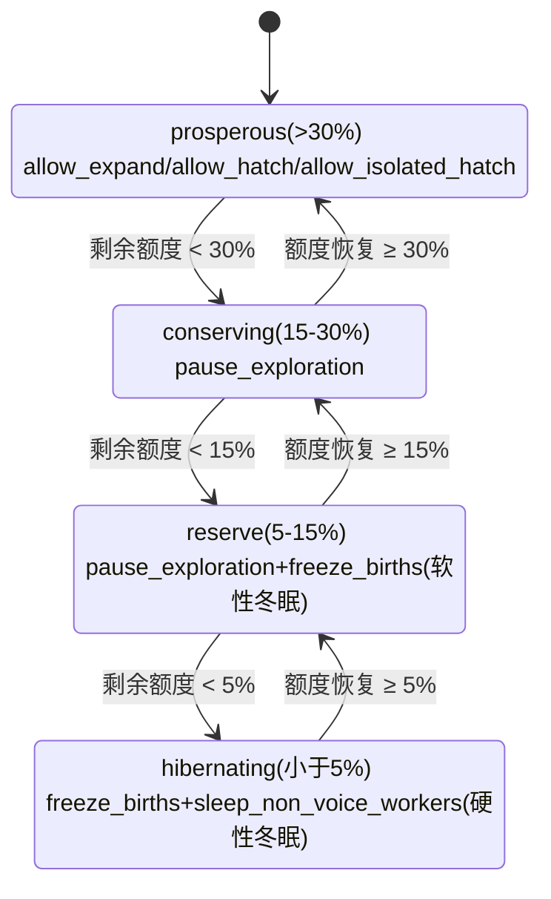

# agent-runtime —— 自主蜂群语音智能体的「大脑」

`agent-runtime` 是 Sisyphus 语音助手的 TypeScript sidecar 进程：任务路由、
worker 角色种姓（caste）管理、生态/经济预算治理、隔离的角色执行，以及
面向语音的事件旁白，全部发生在这里。Python 媒体平面（`app/`）刻意**不**
包含任何业务 LLM/推理逻辑（见仓库根目录 `README_CN.md`）——一次真实对话
的「思考」步骤，全部运行在本包里。

这份文档只覆盖 `agent-runtime/` 自身；整体产品架构、安装与运行方式见仓库
根目录的 `README.md` / `README_CN.md`。

## 目录

- [agent-runtime —— 自主蜂群语音智能体的「大脑」](#agent-runtime--自主蜂群语音智能体的大脑)
  - [目录](#目录)
  - [它在整个生态中的位置](#它在整个生态中的位置)
  - [核心比喻：蜂群生态](#核心比喻蜂群生态)
  - [模块架构与启动顺序](#模块架构与启动顺序)
  - [一次语音指令的完整链路](#一次语音指令的完整链路)
  - [角色矩阵（七个常驻角色）](#角色矩阵七个常驻角色)
  - [语音路由与打断](#语音路由与打断)
  - [权限与提权（Diplomacy Gateway）](#权限与提权diplomacy-gateway)
  - [生态与经济系统](#生态与经济系统)
  - [LLM 接入模式：Cloud only，完全由 pi-ai 接管](#llm-接入模式cloud-only完全由-pi-ai-接管)
  - [存储层](#存储层)
  - [目录结构](#目录结构)
  - [测试与构建健康度](#测试与构建健康度)
  - [已知缺口](#已知缺口)
  - [近期路线图](#近期路线图)
    - [P0 — 直接影响正确性/一致性，工作量小](#p0--直接影响正确性一致性工作量小)
    - [P0 — 影响审计/合规，当前纯内存有丢失风险](#p0--影响审计合规当前纯内存有丢失风险)
    - [P1 — 生态治理的数据闭环，装配层缺失](#p1--生态治理的数据闭环装配层缺失)
    - [P2 — 功能完整性，非阻塞](#p2--功能完整性非阻塞)
    - [P3 — 范围明确排除在外，视产品目标决定是否要做](#p3--范围明确排除在外视产品目标决定是否要做)

## 它在整个生态中的位置



关键约束（贯穿整个系统的硬规则）：

- Python 媒体平面即使与 sidecar 失联，仍能维持完整的 STT/TTS（音频通道
  永远不依赖 sidecar 是否存活）。
- Pi 的流式 token 只在 sidecar 内部聚合成完整句子（见
  `src/roles/pi-event-adapter.ts`），从不逐 token 跨进程、更不会直接怼进
  TTS —— 语音侧永远只看到聚合后的、经过 `VoiceHerald` 内容安全检查的
  文本。
- 原始音频（PCM/raw audio）永远不会出现在这条 WebSocket 事件通道里 ——
  `src/protocol/schema.ts` 的 `assertPayloadIsSafe()` 会在编码前后两端
  拒绝任何键名匹配 `/pcm|raw[_-]?audio/i` 的 payload。

## 核心比喻：蜂群生态

`src/ecology/` 与 `src/economy/` 用一套「蜂群」比喻把「要不要多起几个
worker」「预算紧张时先牺牲谁」这类治理决策，变成一组纯函数、可单测的规则，
而不是让某个 LLM 自由裁量：

| 蜂群概念 | 对应模块 | 现实含义 |
|---------|---------|---------|
| 蜂后 Queen | `src/ecology/queen.ts` | 只读 `FoodState` 快照，产出 `allow_expand` / `freeze_births` / `sleep_non_voice_workers` 等治理决策，本身从不执行任务、不持有 `prompt()`/工具面 |
| 蜂群 Population | `src/ecology/population.ts` | 纯计数簿：active/sleeping/retired 三态成员 + `activeCap`/`isolationCap` 两条独立上限 |
| 基因库 GeneBank | `src/ecology/gene-bank.ts` | 持久化的角色「基因型」`RoleGenome`（能力/工具/提示词片段/模型偏好/出生原因/死亡条件/适应度） |
| 角色孵化器 RoleIncubator | `src/ecology/role-incubator.ts` | 发现能力缺口时，对最近似的已有基因做最小变异，提出一个只跑一次的 trial 基因型 |
| 信息素地图 PheromoneMap | `src/ecology/pheromone-map.ts` | 强化学习式的路由信号：任务特征→角色→模型 的权重，成功强化、失败/用户纠错惩罚，随时间半衰期衰减 |
| 繁荣度 Prosperity | `src/ecology/prosperity.ts` | 5 项外部可观测指标（任务成功率/用户纠错率/超时率/角色复用率/核验失败率）加权得出的健康度，刻意不包含任何「自评置信度」 |
| 采食状态 FoodState | `src/economy/types.ts` | `prosperous`(>30%) / `conserving`(15–30%) / `reserve`(5–15%) / `hibernating`(<5%)，由 `ApiBudgetLedger`（按天付费预算）与 `HttpQuotaProbe`（订阅制配额探测）共同喂给 Queen |

生态状态的转移见下方 [生态与经济系统](#生态与经济系统) 一节的状态图。

## 模块架构与启动顺序

`src/index.ts` 的 `createAgentRuntime()` 是唯一的组合根（composition
root），按固定顺序把 Task 7–16 交付的每个模块串起来；启动全程**不需要**
真实的 Pi/LLM 凭据 —— 注册角色清单、构造 `PiRoleSessionManager` 都不会
建立真正的 Pi Session，只有第一次 `ensure()`/`prompt()` 才会触发。



关闭顺序与此相反并保证幂等：停止接收新入站事件 → 关闭 WebSocket 服务器
→ 并发关闭 SessionManager 与 RpcChamber → 最后关闭 DB Worker。任一步构造
失败都会触发 `rollback()`，按「后开先关」逆序释放已建立的资源，绝不泄漏
DB Worker 线程或还在跑的 metrics 定时器。

## 一次语音指令的完整链路



若指令涉及有风险的工具调用（发邮件、重启服务等），`Session` 侧还会先
经过下一节的 `CapabilityGateway`；被 `ELEVATE` 的调用会产出
`diplomacy.elevation.requested`，`VoiceHerald` 用固定模板播报「准备执行
{action}，可能影响{impact}，是否允许？」，用户口头确认后才真正执行。

## 角色矩阵（七个常驻角色）

全部角色 `lifecycle: "resident"`（与 Node 进程共存，永远不是独立 OS
进程；只有「隔离/试用」角色才走 `RpcChamber`）。清单定义于
`src/roles/manifests.ts`，人格与行为边界的完整提示词在
`resources/roles/*.md`。

| 角色 id | 人格（来自 `resources/roles/*.md`） | 能力 | 工具 | modelClass | thinkingLevel |
|---------|-------------------------------------|------|------|:----------:|:--------------:|
| `general` | General Worker —— 默认角色，通常是用户话语第一个（往往也是唯一）到达的角色 | qa / task-clarification / delegation | `read` | balanced | medium |
| `code` | Code Worker —— 读写/运行真实代码或终端时的专职角色 | code-editing / terminal / file-search | `read,bash,edit,write,grep,find,ls` | deep | high |
| `web` | Web Scout —— 搜索公网、抓取具体页面 | web-search / web-fetch | `web_search,web_fetch` | balanced | medium |
| `device` | Device Steward —— 查看/谨慎控制本机服务 | device-status / service-control | `device_status,service_action`（刻意不给写/编辑工具） | fast | low |
| `mail` | Mail Worker —— 收发指定邮箱的邮件 | mail-search/read/send/triage | `mail_search,mail_read,mail_watch,mail_send,mail_reply,mail_forward,mail_trash,mail_download` | balanced | medium |
| `inspector` | Inspector —— 只读核验，检查其他角色「完成了」的说法是否有证据支撑 | result-verification / evidence-review | `read,grep,find,ls`（无 write/edit/bash，避免核验者污染自己要检查的证据） | balanced | medium |
| `memory` | Memory Curator —— 判断什么值得跨会话永久记住 | memory-curation / preference-tracking | 无（只对已收集好的结构化事件下判断，从不自己取材料） | fast | low |

## 语音路由与打断

`src/routing/` 三个模块全部是**纯函数、同步、从不调用模型**，专门处理
「打断/引导/新任务」这类必须低延迟响应的语音信令，与常规 LLM 推理路径
彻底分离：



`TrafficCommander`（`src/voice/traffic-commander.ts`）负责「我在处理」类
的进度播报节流（首次确认 700ms 延迟、进度播报至少间隔 5s、阶段未变化绝
不重复）；`VoiceHerald`（`src/voice/voice-herald.ts`）是唯一能把文本送
进 TTS 的关卡，双层过滤：事件类型白名单 + 内容安全检查（拒绝代码块、
JSON、长 URL、超过 160 字、含未核实措辞的文本）。

## 权限与提权（Diplomacy Gateway）



邮件工具（`src/tools/mail/agently-mail.ts`）是这套机制的典型消费者：
每一次逻辑上的发送/回复/转发只调用一次 `CapabilityGateway.execute()`，
真实收件人数量作为 `externalAudience` 传入 —— 群发与单发的提权区分完全
靠这一个字段，没有另写「批量检测」逻辑。

## 生态与经济系统



- **prosperous**（剩余额度 >30%）：`allow_expand` / `allow_hatch` / `allow_isolated_hatch`。
- **conserving**（15%–30%）：`pause_exploration`。
- **reserve**（5%–15%）：`pause_exploration` + `freeze_births`（软性冬眠 —— 非语音必要角色的 prompt 被拒）。
- **hibernating**（<5%）：`freeze_births` + `sleep_non_voice_workers`（硬性冬眠 —— 任何 Pi prompt 都不允许执行）。

`Queen.evaluate()` 本身不持有定时器 —— 由 `evaluateOnCadence()` 按调用
方喂入的时钟节流（默认每 30 秒或每 20 个任务终态事件评估一次，先到者
先触发）。`ApiBudgetLedger` 把预算切成两块从不合并的部分：普通 worker
可用的余额，以及 worker 永远碰不到的 `voiceReserveUsd`（专门留出来，确
保系统在任何时候都还有预算说出「预算紧张」这句话本身）。

## LLM 接入模式：Cloud only，完全由 pi-ai 接管

与 STT/TTS 媒体平面（`app/model_providers.py`）不同 —— 那里 Local/Cloud
两种模式并存，且 Cloud 模式下每个 provider/model 都有独立的适配器 spec
（`app/model_adapters/specs/*.json`：`cloud_speech.json`/
`cloud_transcription.json` 对应 Cloud，`omlx_*.json` 对应 Local）——
`agent-runtime` 的 LLM 推理**目前只有 Cloud 一种模式**，且这一模式完全
由 `@earendil-works/pi-coding-agent`（内部依赖 `pi-ai`）接管，本包不做
任何自己的 provider/model 选择：

- `src/config.ts` 的 `AgentRuntimeConfig` 里**没有任何** LLM
  provider/model/API-key 字段 —— 只有传输、存储、预算相关的配置。
- `RoleManifest.modelClass`（`"fast" | "balanced" | "deep"`，见
  `src/roles/types.ts`）和 `RoleGenome.modelPolicy`
  （`src/ecology/gene-bank.ts`）都是**已声明、已在全部 7 个角色清单里
  填好、但从未被任何代码消费**的字段 —— 它们只表达「这个角色期望多强的
  模型」这个意图，具体路由到哪个 provider/model 由 pi-ai SDK 自己的默
  认逻辑决定，这是一处明确、有文档记录的设计留白（见
  `src/roles/session-manager.ts` 与 `src/isolation/rpc-chamber.ts` 里
  `createDefaultPiSessionProvider()`/`createPiRpcProcessSpawner()` 各自
  的文档注释：模型路由是「a later task's concern」）。
- 实际发起 LLM 调用的唯一路径是 `createDefaultPiSessionProvider()`
  （`src/roles/session-manager.ts`）里的 `createAgentSession()` ——
  这是 `@earendil-works/pi-coding-agent` SDK 的真实入口，credentials/
  模型选择全部由 pi-ai 自身的配置（如 `~/.pi/agent`）决定，`agent-runtime`
  不拦截、不重写、不做二次封装。
- 唯一的例外是 `RpcChamber`（隔离角色的独立 OS 进程）：
  `createPiRpcProcessSpawner()` 传入固定的 `provider="anthropic"`/
  `model="default"`，对所有隔离角色一视同仁，同样**不读取**该角色
  genome 自己的 `modelPolicy`。

也就是说：「LLM 只需要 Cloud 模式」和「Cloud 模式由 pi-ai 完全接管」都
已经是当前代码的真实状态，不需要额外开发；`modelClass`/`modelPolicy`
两个字段是留给未来「把粗粒度意图路由到具体模型」这一步的挂钩点，目前
故意保持空转。

## 存储层

SQLite 只允许在 `worker_threads.Worker` 里打开 —— `src/storage/database.ts`
（主线程）完全不 import `better-sqlite3`；唯一允许构造 `Database` 的文件
是 `src/storage/db-worker.ts`（模块加载时断言 `!isMainThread`）。写操作
按 20ms/50 条两个阈值批量提交（`db.transaction()`），但每条写入仍然拿到
自己独立的响应 —— 批处理只改变「何时」提交，从不改变「是否」如实告知
调用方结果。`task.assimilate` 是里面最复杂的复合命令：在批处理事务内部
再嵌套一个 `db.transaction()`（better-sqlite3 对嵌套事务自动走
SAVEPOINT/RELEASE），把「任务终态」「角色 upsert」「适应度增量」「信息
素增量」「记忆写入」这五件事绑成一个真正的全有或全无的原子操作。Schema
版本用 SQLite 内建的 `user_version` pragma 管理（v1：`events`/`roles`/
`tasks`/`role_fitness`/`budgets`/`pheromones`/`memories`；v2：追加
`runtime_metrics`），无需额外的迁移记录表。

## 目录结构

```text
agent-runtime/
├── src/
│   ├── config.ts              # 环境变量 → 运行时配置
│   ├── index.ts                # 组合根：createAgentRuntime()
│   ├── protocol/                # RealtimeEvent 线协议（与 app/realtime/events.py 逐字节对应）
│   ├── transport/                # WebSocket 服务器 + 出站优先级队列
│   ├── roles/                    # 角色清单 / 注册表 / Pi Session 管理 / 事件适配
│   ├── tasks/                     # 任务巢（内存为准，SQLite 只做持久化）+ 入站事件路由
│   ├── routing/                    # 打断路由 / 压力评估（纯函数，从不调用模型）
│   ├── voice/                       # 进度播报节流 + 语音内容安全关卡
│   ├── tools/                        # 每个角色的工具实现 + 提权网关
│   ├── economy/                       # 预算账本 / 订阅配额探测 / provider 排序
│   ├── ecology/                        # 蜂群治理：Queen / Population / GeneBank / …
│   ├── isolation/                      # 隔离角色的独立 OS 进程沙箱
│   ├── storage/                        # worker_threads 里的 SQLite
│   ├── inspection/                     # 证据驱动的结果核验
│   └── memory/                         # 永久记忆的准入判断
├── resources/roles/*.md         # 每个角色的完整人格/行为边界提示词
├── test/                          # 与 src/ 一一对应的 vitest 用例
└── data/agent-runtime.sqlite3      # 运行时数据库（gitignored）
```

## 测试与构建健康度

截至最近一次核查（`npm test` / `npx tsc -p tsconfig.json --noEmit`）：

- **35 个测试文件、509 个用例，全部通过**，0 失败、0 跳过。其中包含真
  实的延迟/性能预算测试：`ReflexRouter.route()` 在 10 万次调用上 p95
  < 2ms；DB 争用下事件循环延迟 p95 在预算内；1000 轮会话下常驻内存
  （RSS）稳定不增长。
- **TypeScript 编译（`tsc --noEmit`）零错误**。

结论：本包声明的功能面已经落地并有测试覆盖；下面「已知缺口」列出的都
是**有文档记录、故意延后**的设计留白，不是隐藏的半成品。

## 已知缺口

（按影响面从大到小排列；每一条在源码里都有对应的文档注释可查）

- ~~模型路由半接线~~ **已收尾（2026-07-26）**——常驻角色
  （`PiRoleSessionManager.createDefaultPiSessionProvider()`）与隔离角色
  （`RpcChamber` 的 `createPiRpcProcessSpawner()`）现在都经
  `src/roles/model-routing.ts` 的 `resolveRoleModel()` 把
  `modelClass`/`genome.modelPolicy.preferredClass` 解析成具体
  `provider:modelId`，走 `ModelCatalog.getAvailable()` 做凭证校验，配错
  会显式抛 `UnresolvedRoleModelError` 而不是静默换模型（见 `config.ts`
  的 `AGENT_RUNTIME_MODEL_FAST/BALANCED/DEEP`）。`RpcChamber` 的
  `spawner` 因此多了一个真实的 await 点，`RpcChamber.spawn()` 相应加了
  `pendingSpawns` 预留计数，避免并发 `spawn()` 在这个 await 点之间双双
  越过容量上限。
- ~~`CapabilityGateway` 的提权记录仍是纯内存~~ **已接线（2026-07-27）**：
  `onLog`/`onElevationRequested`/`onElevationResolved` 三个钩子现在由
  `src/tools/diplomacy-persistence.ts` 的 `createDiplomacyPersistenceHooks()`
  实现——分别落 `diplomacy_log`/`diplomacy_pending_elevations`/
  `diplomacy_elevation_approvals` 三张新表（migrations.ts version 3），
  且 `onElevationRequested`/`onElevationResolved` 会真正 emit
  `diplomacy.elevation.requested`/`resolved` 这两个协议里已定义好的
  RealtimeEvent（经 `server.broadcast()`）。`onLog` 的 `DiplomacyLogEntry`
  没有对应的 RealtimeEventType，因此只持久化、不广播。持久化/广播失败会
  被吞掉并转发到 `onPersistError`（镜像 `runtime-metrics.ts` 的
  `onSample`/`onPersistError`），永远不会让一次审计写入失败反过来污染
  `CapabilityGateway.execute()`/`approve()` 已经成功的那一半。**已知的
  刻意留白**：出站事件的 `sequence` 目前只是进程内自增计数器，没有跨重
  启的持久化序号源——这是当前唯一发出 RealtimeEvent 的 Node 侧代码，尚
  无现成序号基础设施可复用；见 `diplomacy-persistence.ts` 的
  `DiplomacyPersistenceOptions.nextSequence` 文档注释。
- ~~`PopulationRegistry.isolationCap` 与 `RpcChamber.capacity` 是两条
  独立维护的上限~~ **已统一（2026-07-26）**：`src/index.ts` 构造
  `RpcChamber` 时直接传入 `population.isolationCap`，`PopulationRegistry`
  是唯一真源；裸构造的 `new RpcChamber()`（如测试）仍回退到与
  `population.ts` 相同的默认值 1。
- **`GeneBank`/`PopulationRegistry`/`PheromoneMap` 均为纯内存结构**：
  对应的 SQLite 表（`roles`/`pheromones`/`memories`）已经建好，
  `db-worker.ts` 的 `task.assimilate` 命令也已经能原子写入，但目前没有
  编排层在任务终态时主动调用它——这一装配步骤留给后续任务。
- **`AgentlyMailClient.watch()` 只是单次轮询**，不是 `agently-cli
  +watch` 提供的真实持续流式推送；`stop()` 目前是空操作。
- **`Queen` 的 `"merge"`/`"wake"` 决策类型、`PopulationRegistry.retire()`**
  已经存在于类型系统里，但尚无任何触发源会产生它们——留给后续任务接入
  具体触发条件。
- 邮件之外的具体设备控制器（`DeviceStatusProvider`/`ServiceController`
  真实实现）仍是可注入的接口占位，`src/tools/device-tools.ts` 明确标注
  「生产环境接线在本任务范围之外」。

以上均不影响当前已实现功能的正确性——全部由测试覆盖，只是刻意还没往
下一层深挖的方向。


## 近期路线图
### P0 — 直接影响正确性/一致性，工作量小
1. [x] RpcChamber 模型路由收尾（**2026-07-26 完成**）：`createPiRpcProcessSpawner()` 现在复用 `resolveRoleModel()`（走 `catalog.getAvailable()` 校验），读取隔离角色 genome 的 `modelPolicy.preferredClass` 而不是写死 `anthropic:default`。配错在子进程 spawn 前就显式抛 `UnresolvedRoleModelError`，不会静默退化——和常驻角色那半保持同一条设计原则。副作用：spawner 签名从同步改为可 async，`RpcChamber.spawn()` 加了 `pendingSpawns` 预留计数以保住并发场景下的容量上限（见 `rpc-chamber.test.ts` 新增的并发用例）。测试：`test/isolation/rpc-chamber.test.ts`（28 tests，含 3 个新增的 async-spawner/并发用例 + 3 个新增的 model-routing 用例）。

### P0 — 影响审计/合规，当前纯内存有丢失风险
2. [x] CapabilityGateway 提权持久化接线（**2026-07-27 完成**）：新增 `src/tools/diplomacy-persistence.ts` 的 `createDiplomacyPersistenceHooks()`，把 onLog/onElevationRequested/onElevationResolved 接到新迁移的 `diplomacy_log`/`diplomacy_pending_elevations`/`diplomacy_elevation_approvals` 三张表（migrations.ts version 3，`src/storage/database.ts`/`db-worker.ts` 新增 `diplomacy.log`/`diplomacy.elevation-requested`/`diplomacy.elevation-resolved` 三个写命令 + 三个 `*.list` 读命令），并把 `diplomacy.elevation.requested`/`resolved` 这两个协议里已定义好的 RealtimeEvent 经 `server.broadcast()` 真正 emit 出去。测试：`test/storage/database.test.ts`（+6 用例）、`test/tools/diplomacy-persistence.test.ts`（新增，8 用例）。已知留白：出站事件 `sequence` 只是进程内计数器，非跨重启持久化序号（见该模块 doc comment）。

### P1 — 生态治理的数据闭环，装配层缺失
3. [ ] Ecology 状态持久化装配：GeneBank/PopulationRegistry/PheromoneMap 目前是纯内存，task.assimilate 这条原子写入命令已经能用，但没有任何编排层在任务终态时调用它——需要在 TaskNest 或类似位置接一个「任务结束 → assimilate」的钩子。这条不做，进程重启后基因型/信息素/角色适应度全部归零，蜂群治理形同虚设。
4. [x] PopulationRegistry.isolationCap 与 RpcChamber.capacity 统一（**2026-07-26 完成，随 #1 一起改**）：`src/index.ts` 构造 `RpcChamber` 时改为 `new RpcChamber({ capacity: population.isolationCap })`，`PopulationRegistry` 成为唯一真源，消除了漂移风险。

### P2 — 功能完整性，非阻塞
5. [ ] Queen 的 merge/wake 决策 + PopulationRegistry.retire() 触发条件：类型已存在，缺具体触发规则（比如两个角色能力高度重叠时 merge、休眠角色被高频路由命中时 wake）。依赖 #3 的持久化数据（适应度、信息素）才能做出有意义的判断，建议排在 #3 之后。
6. [ ] AgentlyMailClient.watch() 真实流式化：从单次轮询换成 agently-cli +watch 的 NDJSON 持续流，stop() 也要从空操作变成真正取消底层进程/连接。

### P3 — 范围明确排除在外，视产品目标决定是否要做
7. [ ] 设备控制器真实实现（DeviceStatusProvider/ServiceController）：接口占位已经很完整，缺的是"具体接哪些系统"这个产品决策，工作量取决于目标平台（systemd？launchd？特定 IoT 网关?），建议先明确范围再排期。

进度：1、2、4 已完成。建议顺序：3 → 5 → 6 → 7。#3 是"接线已就位、缺最后一步"，性价比最高；5/6/7 需要新的产品/行为决策，适合放后面单独开任务讨论范围。